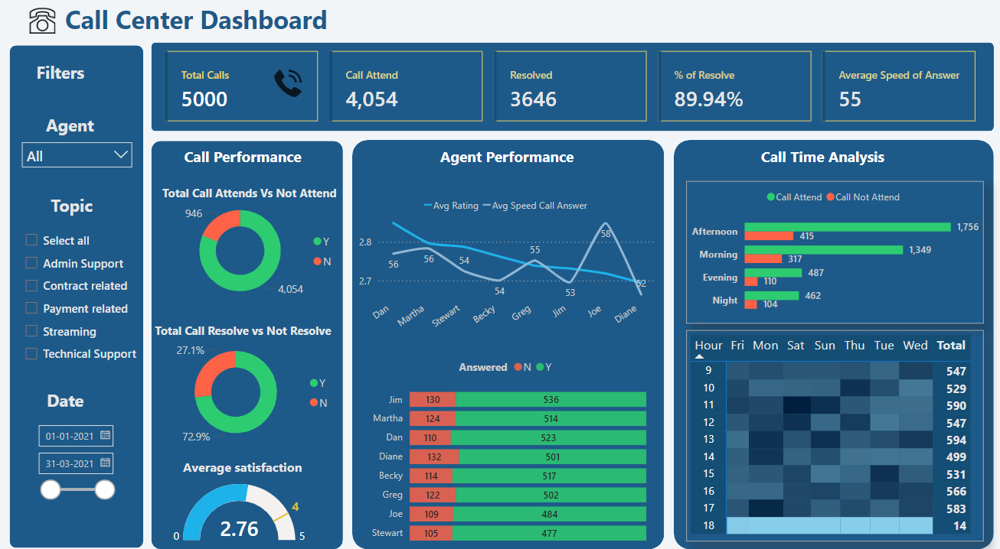

# Call Center Dashboard - PwC Power BI Virtual Case Experience (Forage)

## 📊 Dashboard Preview

## 📌 Project Overview

This project was completed as part of the **PwC Power BI Virtual Case Experience**, offered by Forage in collaboration with PwC. The goal was to analyze call center data and build an interactive **Power BI dashboard** to track key performance indicators (KPIs) and enhance operational efficiency.

---

## 🛑 Problem Statement

PhoneNow, a leading customer support provider, faced challenges in monitoring call center performance. Key concerns included:

- High call abandonment rates 📉
- Slow response times ⏳
- Inefficiencies in call resolution ⚠️
- Lack of agent performance insights 📊
- Limited visibility into peak call times ⏰

PhoneNow's management required a **data-driven approach** to optimize agent allocation, improve customer experience, and enhance operational transparency.

---

## ✅ Solution: Interactive Power BI Dashboard

To address these challenges, I developed a **Call Center Dashboard** using Power BI. The dashboard provides a clear, data-driven view of performance metrics.

### 🔹 Features & Insights:

1. **📞 Call Performance Overview**

   - Total Calls: **5,000** (Attended: **4,054**, Abandoned: **946**)
   - Call Resolution Rate: **89.94%** 📈
   - Average Speed of Answer: **55 seconds**
   - Customer Satisfaction Score: **2.76/5**

2. **📊 Agent Performance Metrics**

   - Individual agent efficiency tracking
   - Call handling time analysis
   - Customer feedback integration

3. **🕒 Call Distribution Analysis**

   - Calls segmented by **time slots** (Morning, Afternoon, Evening, Night)
   - Peak call hour identification with a heatmap

4. **📉 Unattended vs. Resolved Calls**
   - Pie charts to visualize call outcomes
   - Breakdown of unresolved issues for process improvement

---

## 🎯 Business Impact

🚀 **Increased Operational Transparency:** PhoneNow's management can now **track KPIs in real-time** and make informed decisions.  
💡 **Improved Efficiency:** Data insights help optimize **agent staffing** and **reduce call wait times**.  
📢 **Better Customer Experience:** Identifying problem areas leads to targeted improvements, enhancing **customer satisfaction**.

---
