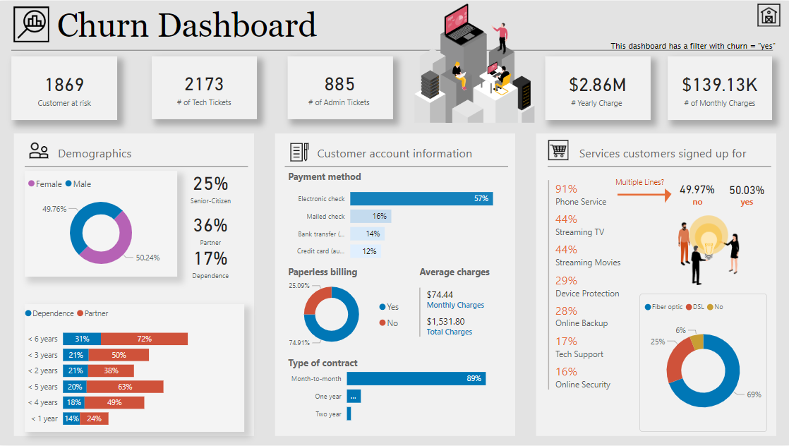
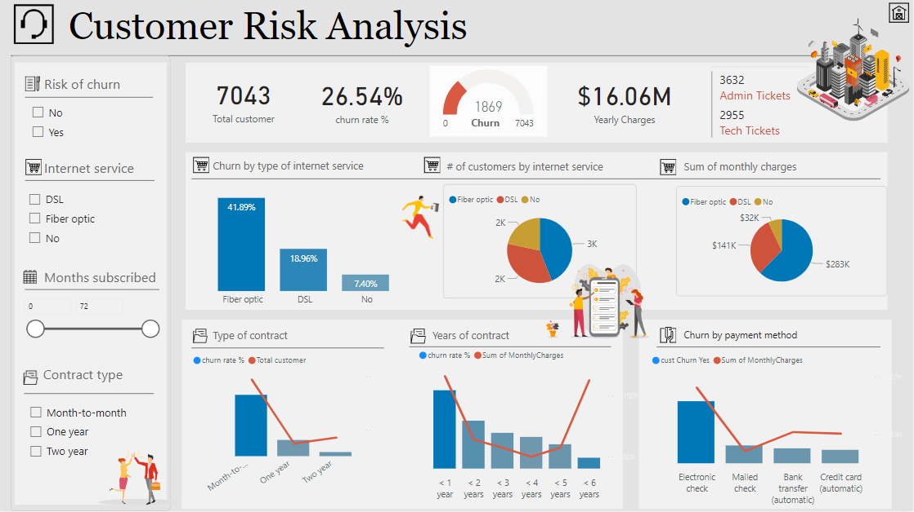

# Churn Analysis Dashboard – Power BI Project

## 📊 Dashboard Preview

  

## 📌 Project Overview

This project focuses on building a **Power BI Dashboard** to analyze **customer churn** patterns in a telecommunications company. The goal is to identify key factors influencing customer churn and help the business take **proactive measures** to improve retention.

---

## 🛑 Problem Statement

Customer churn is a major concern for telecom providers due to its impact on revenue and brand reputation. The company faced several challenges:

- High churn rate across certain customer segments 📉
- Lack of visibility into service usage patterns 📊
- Unclear impact of contracts and payment methods on churn 💳
- Insufficient insights into demographic behavior 👥
- Difficulty identifying risk factors to target retention efforts 🎯

The business needed a **data-driven dashboard** to visualize churn data and uncover patterns that could guide retention strategies.

---

## ✅ Solution: Interactive Power BI Dashboard

To address these challenges, I developed an **interactive dashboard** in Power BI, delivering a complete view of customer churn metrics and behavioral insights.

### 🔹 Features & Insights:

1. **📞 Churn Overview**

   - Total Customers: **7,043**
   - Churned Customers: **1,869**
   - Churn Rate: **26.54%**
   - Monthly Charges: **$456,112+**
   - Yearly Revenue Loss Estimate: **$16.06M**

2. **🖥️ Churn by Internet Service**

   - **Fiber Optic** users have the highest churn (41.89%)
   - **DSL** churn is moderate (18.96%)
   - **No Internet Service** users show lowest churn (7.40%)

3. **📄 Impact of Contract Type**

   - **Month-to-Month:** Highest churn rate
   - **Two-Year Contracts:** Lowest churn – indicates customer loyalty

4. **💳 Payment Method Analysis**

   - **Electronic Check:** Highest churn group
   - **Credit Card / Auto Payments:** Associated with lower churn

5. **📋 Paperless Billing & Services**

   - 75% of churned customers **did not opt** for paperless billing
   - Churned users were **less likely to use** tech support, online security, or device protection

6. **👥 Customer Demographics**
   - Gender Split: **50.24% Female**, **49.76% Male**
   - Senior Citizens: **25%**
   - Customers with Dependents: **17%**

---

## 🎯 Business Impact

🚀 **Data-Driven Strategy:** Management can now target high-churn customer segments and reduce revenue loss.  
📊 **Improved Retention:** Identifying churn triggers helps implement better retention plans.  
💡 **Service Improvement:** Usage-based churn insights allow tailored service bundles and promotions.  
📈 **Revenue Protection:** Helps preserve long-term customer value by identifying early churn signals.

---
