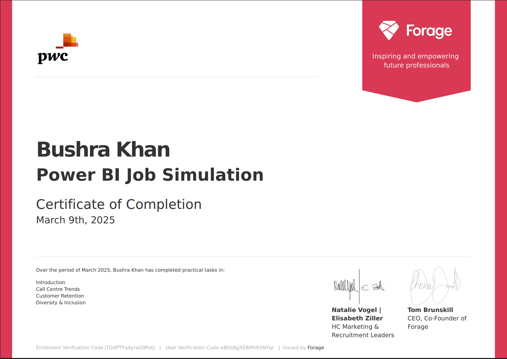

# PwC - Power BI

This repository contains the Power BI projects completed as part of the **PwC Switzerland - Power BI Job Simulation** hosted on Forage.

## 🔸 Projects Included:

### 📊 Call Center

### 📊 Customer Churn Analysis

  

### 📊 Gender Equality Insights

Each folder contains the respective dataset, Power BI dashboard, and a brief explanation.

---

📄 **Certificate:**  
![PwC Certificate]

🧠 **Skills Applied:** Data Cleaning, DAX, Visual Analytics, Storytelling, Dashboard Design
